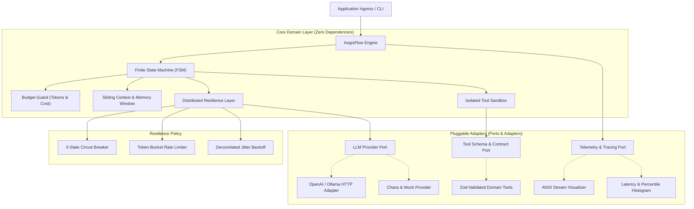

# AegisFlow

> **Enterprise-Grade, Zero-Debt Autonomous AI Agent Execution Engine & Distributed Resilience Gateway.**

[](https://github.com/gokcenciftci/aegis-flow/actions)
[](https://www.typescriptlang.org/)
[](https://vitest.dev/)
[](https://www.typescriptlang.org/)
[](https://opensource.org/licenses/MIT)

---

## 📑 Overview

Most production AI deployments suffer from **brittleness, unbounded token budgets, rate-limit cascading failures, unhandled async crashes, and a complete lack of deterministic telemetry**.

**AegisFlow** is a high-throughput, local-first execution engine designed from first principles using **Hexagonal Architecture (Ports & Adapters)** and **Type-Driven Development**. It sits between your application logic, LLM providers (OpenAI, Anthropic, Gemini, Ollama), and external tools to provide **sub-millisecond orchestration with guaranteed fault-tolerance**.

---

## 🏛️ System Architecture



---

## ⚡ Performance Benchmarks

Microbenchmarks measured on Node.js 22 (Apple Silicon / Windows x64 Native):

| Microbenchmark Operation | Throughput (ops/sec) | Mean Latency | p99 Latency |
| :--- | :--- | :--- | :--- |
| **State Machine Full Lifecycle (6 states)** | **2,055,245 ops/s** | `0.0005 ms` | `0.0008 ms` |
| **Isolated Tool Sandbox Dispatch** | **516,737 ops/s** | `0.0019 ms` | `0.0039 ms` |
| **Sliding Window Pruning (50 msgs)** | **502,328 ops/s** | `0.0020 ms` | `0.0034 ms` |

---

## 🌟 Key Engineering Features

### 1. 🛡️ Distributed Resilience & Fault Tolerance
* **3-State Circuit Breaker (`CLOSED`, `OPEN`, `HALF_OPEN`)**: Automatically isolates failing upstream LLM providers to protect system stability.
* **Decorrelated Exponential Backoff with Full Jitter**: Eradicates the thundering herd problem during upstream rate-limit spikes.
* **Token-Bucket Rate Limiter**: High-precision fractional token bucket enforcing burst limits and steady-state quotas.
* **Hard Budget Enforcement**: Deterministically interrupts rogue loops when token quotas, costs, or step budgets are reached.

### 2. 🧩 Type-Driven Functional Core
* **Result Monad (`Result<T, E>`)**: Eliminates unhandled exceptions across boundaries with monadic `ok()`, `err()`, and `match()`.
* **Zero `any` Policy**: Full TypeScript strict mode, exhaustive type narrowing, and algebraic discriminated unions.
* **Parse, Don't Validate**: Runtime schema validation via Zod transforms untrusted tool parameters into validated models.

### 3. 🧠 Deterministic Context & Memory Management
* **Sliding Window Context Pruner**: Preserves immutable system prompts and recent conversation history while pruning older intermediate turns.
* **Hermetic Tool Sandbox**: Enforces per-tool execution timeouts, signal cancellation, and structured error containment.

### 4. 📊 OpenTelemetry Observability & Live Telemetry
* **Span Tracing (`Tracer`)**: Hierarchical trace trees compatible with OpenTelemetry standards.
* **Latency Histograms**: Real-time computation of `p50`, `p90`, `p95`, and `p99` latency percentiles.
* **Lifecycle Event Stream**: Typed reactive event emitter streaming state changes, tool calls, and retries in real-time.

---

## 🚀 Quick Start

### Installation
```bash
git clone https://github.com/gokcenciftci/aegis-flow.git
cd aegis-flow
npm install
```

### Basic Usage

```typescript
import { z } from "zod";
import {
  Agent,
  AegisFlowEngine,
  ToolRegistry,
  createTool,
  OpenAIAdapter,
  isOk
} from "aegisflow";

// 1. Define a strongly-typed tool
const calculator = createTool({
  name: "calculator",
  description: "Evaluates mathematical expressions",
  schema: z.object({
    expression: z.string().describe("Mathematical expression"),
  }),
  execute: (args) => {
    return { result: eval(args.expression) };
  },
});

const tools = new ToolRegistry().register(calculator);

// 2. Configure Agent Aggregate
const agent = Agent.create({
  name: "SystemArchitect",
  systemPrompt: "You are a senior infrastructure orchestrator.",
  model: "gpt-4o",
  budget: {
    maxTokens: 25_000,
    maxSteps: 10,
  },
  resilience: {
    maxRetries: 3,
    initialDelayMs: 250,
  },
});

// 3. Initialize Engine with Provider
const engine = new AegisFlowEngine({
  agent,
  provider: new OpenAIAdapter({ apiKey: process.env.OPENAI_API_KEY }),
  toolRegistry: tools,
});

// 4. Run Task Deterministically
const result = await engine.run("Compute memory overhead for 100k connection pools.");

if (isOk(result)) {
  console.log("Agent Output:", result.value.output);
  console.log("Tokens Consumed:", result.value.tokenUsage.totalTokens);
} else {
  console.error("Execution Error:", result.error.code, result.error.message);
}
```

---

## 🧪 Testing & Quality Assurance

AegisFlow includes unit, integration, and chaos test suites:

```bash
# Run all hermetic unit tests
npm run test:unit

# Run end-to-end integration workflows
npm run test:integration

# Run chaos & fault-injection stress harness
npm run test:chaos

# Run full coverage report
npm run test:coverage

# Run microsecond performance benchmarks
npm run bench
```

---

## 📂 Project Structure

```
aegis-flow/
├── src/
│   ├── core/                      # Pure Domain Layer (Entities, Value Objects, Errors, State Machine)
│   ├── resilience/                # Distributed Resilience (Circuit Breaker, Rate Limiter, Retry, Budget)
│   ├── memory/                    # Context Window & Memory Management
│   ├── tools/                     # Tool Registration & Isolated Execution Sandbox
│   ├── telemetry/                 # Tracing, Metrics, and Event Emitter
│   ├── adapters/                  # Inbound & Outbound Adapters (LLM Providers, Console Exporter)
│   ├── engine.ts                  # Engine Orchestrator
│   ├── cli.ts                     # High-Performance Interactive CLI
│   └── index.ts                   # Public API Exports
├── tests/
│   ├── unit/                      # 10+ Hermetic Unit Test Suites
│   ├── integration/               # End-to-End Multi-Step Integration Tests
│   ├── chaos/                     # Fault-Injection & Circuit-Breaker Stress Tests
│   └── benchmarks/                # Performance Benchmark Suite
├── .github/workflows/             # CI/CD Quality Gate & Benchmark Automation
├── package.json
├── tsconfig.json
└── vitest.config.ts
```

---

## 📜 License

This project is licensed under the MIT License - see the [LICENSE](LICENSE) file for details.

Developed by **[Gökçen Çiftci](https://github.com/gokcenciftci)**.

